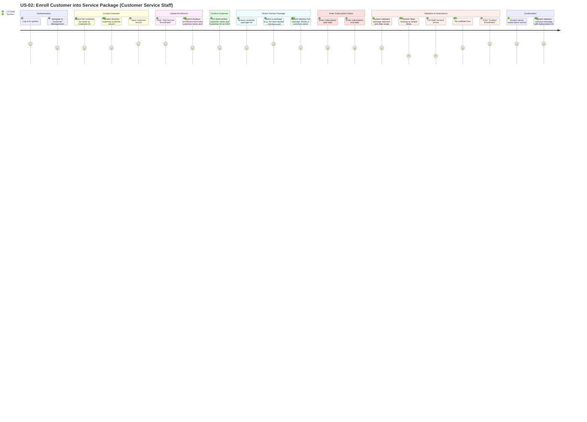

# US-02 User Journey — Enroll Customer into Service Package

**User Story:**
> As a **Customer Service Staff**, I want to enroll a customer into a service package (e.g. 5G Next Speed, 599 ฿/month) and record the subscription start and end dates, so that the customer's active service is tracked and managed correctly.

---

## User Journey Diagram

---

## Journey Summary

| Step | Actor | Action | Satisfaction |
|---|---|---|---|
| 1 | CS Staff | Log in and navigate to Customer Management | High |
| 2 | CS Staff + System | Search for and open an existing customer record | High |
| 3 | CS Staff + System | Initiate enrollment; form opens pre-loaded with customer details | High |
| 4 | CS Staff | Verify customer name and Customer ID on form header | High |
| 5 | CS Staff + System | Browse package list, select a package, review details panel | High |
| 6 | CS Staff | Enter subscription start date and end date | Medium |
| 7 | CS Staff + System | Validate form and correct any errors | Low–High |
| 8 | System | Save subscription record and return Subscription ID | High |

---

## Notes

- **Prerequisite — registered customer**: A valid Customer ID must already exist in the system (completed via US-01) before enrollment can proceed.
- **Customer confirmation**: The form header pre-loads the customer's name and ID so the CS Staff can verify the correct customer before making any changes.
- **Package detail panel**: Selecting a package immediately reveals full details (fee, call minutes, data allowance) to help the CS Staff confirm the right package with the customer.
- **Date validation**: End date must be strictly after start date; the system must prevent submission if this rule is violated.
- **Subscription ID**: Upon successful enrollment, a unique Subscription ID is generated and displayed for reference and audit purposes.
