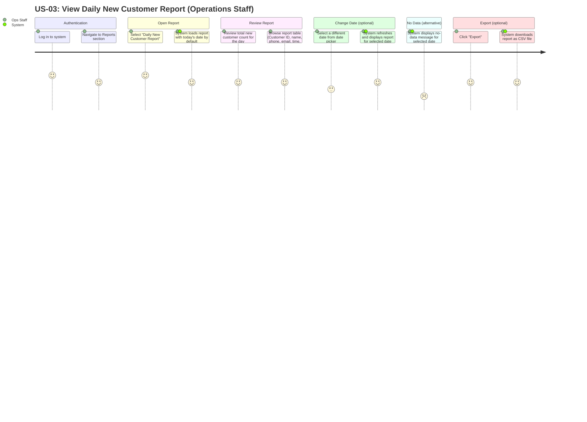

# US-03 User Journey — View Daily New Customer Report

**User Story:**
> As an **Operations Staff**, I want to view a daily report of newly registered customers, so that I can monitor business growth and follow up with onboarding processes.

---

## User Journey Diagram

---

## Journey Summary

| Step | Actor | Action | Satisfaction |
|---|---|---|---|
| 1 | Ops Staff | Log in and navigate to Reports section | High |
| 2 | Ops Staff + System | Open Daily New Customer Report; report loads for today by default | High |
| 3 | Ops Staff | Review total count and customer rows for the selected date | High |
| 4 | Ops Staff + System | (Optional) Select a different date; report refreshes | Medium–High |
| 5 | System | (Alternative) Display no-data message when no registrations found | Low |
| 6 | Ops Staff + System | (Optional) Export report as CSV | High |

---

## Notes

- **Default date**: The report always defaults to today's date on load to minimise the steps needed for the most common daily check.
- **Read-only**: The report is a read-only view. No customer data can be edited from this screen.
- **Registered by**: Displaying the CS Staff name who registered each customer supports accountability and audit trails.
- **CSV export**: The exported filename should include the report date (e.g. `new-customers-2026-02-21.csv`) so files are easily identifiable when saved.
- **Data source**: Report rows are derived from `CUSTOMER.created_at` filtered to the selected date, joined to `USER` for the "Registered By" column.
