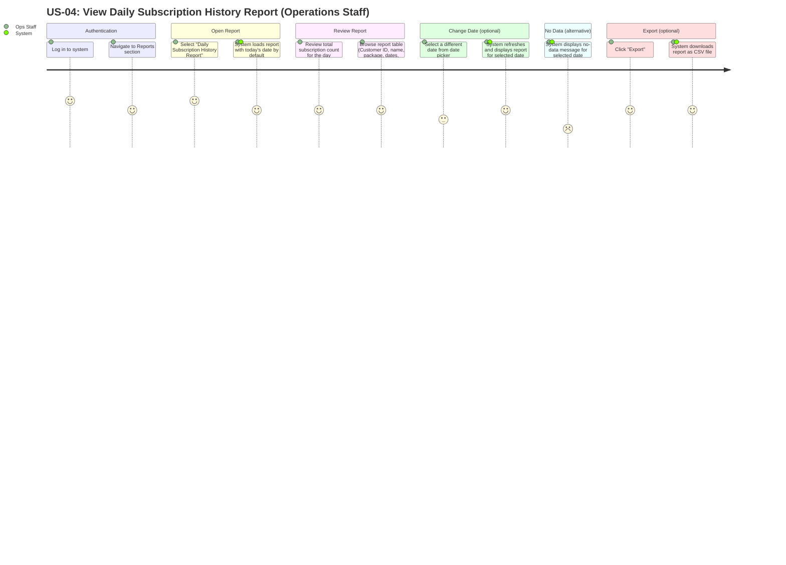

# US-04 User Journey — View Daily Subscription History Report

**User Story:**
> As an **Operations Staff**, I want to view a daily service subscription history report for each customer, so that I can audit subscription changes and ensure accurate billing records.

---

## User Journey Diagram

---

## Journey Summary

| Step | Actor | Action | Satisfaction |
|---|---|---|---|
| 1 | Ops Staff | Log in and navigate to Reports section | High |
| 2 | Ops Staff + System | Open Daily Subscription History Report; report loads for today by default | High |
| 3 | Ops Staff | Review total count and subscription rows for the selected date | High |
| 4 | Ops Staff + System | (Optional) Select a different date; report refreshes | Medium–High |
| 5 | System | (Alternative) Display no-data message when no subscription records found | Low |
| 6 | Ops Staff + System | (Optional) Export report as CSV | High |

---

## Notes

- **Default date**: The report always defaults to today's date on load to minimise the steps needed for the most common daily audit check.
- **Read-only**: The report is a read-only view. No subscription data can be edited from this screen.
- **Enrolled By**: Displaying the CS Staff name who enrolled each subscription supports accountability and audit trails.
- **CSV export**: The exported filename should include the report date (e.g. `subscription-history-2026-02-21.csv`) so files are easily identifiable when saved.
- **Data source**: Report rows are derived from `SUBSCRIPTION.created_at` filtered to the selected date, joined to `CUSTOMER` for customer details, `SERVICE_PACKAGE` for package name, and `USER` for the "Enrolled By" column.
