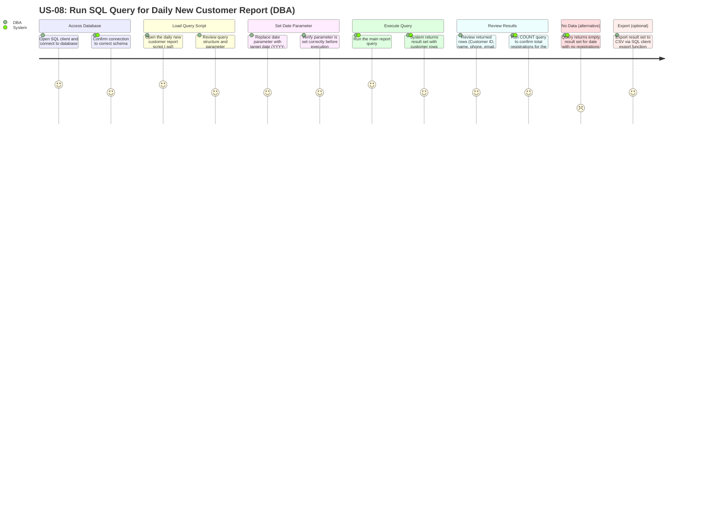

# US-08 User Journey — Run SQL Query for Daily New Customer Report

**User Story:**
> As a **Database Administrator**, I want to run a SQL query to retrieve a new customer registration report for each day, so that I can access raw registration data directly from the database for analysis and auditing.

---

## User Journey Diagram

---

## Journey Summary

| Step | Actor | Action | Satisfaction |
|---|---|---|---|
| 1 | DBA | Connect to database via SQL client and confirm correct schema | High |
| 2 | DBA | Open the daily new customer report `.sql` script | High |
| 3 | DBA | Set the target date parameter to the desired date | High |
| 4 | DBA + System | Execute main report query; system returns customer rows | High |
| 5 | DBA + System | Run COUNT query to verify total new registrations for the date | High |
| 6 | System | (Alternative) Return empty result set when no registrations exist for the date | Low |
| 7 | DBA | (Optional) Export result set to CSV via SQL client | High |

---

## Notes

- **Direct database access**: This story does not involve any web UI. The DBA interacts directly with the database using a SQL client (e.g., DBeaver, MySQL Workbench, pgAdmin, or similar).
- **Query parameterisation**: The script must use a clear parameter placeholder (e.g., a comment-marked variable or a bind variable) so the DBA only changes the date value, not the query logic.
- **Date filtering**: Filtering is applied on `CUSTOMER.created_at` using a date-only comparison (`DATE(created_at) = :target_date` or equivalent) to capture all registrations regardless of time of day.
- **Staff name resolution**: The query must `JOIN USER ON CUSTOMER.created_by = USER.user_id` to return `USER.full_name` as the "Registered By" column, consistent with the data shown in the US-03 Operations Staff report.
- **COUNT companion query**: A separate `SELECT COUNT(*) FROM CUSTOMER WHERE DATE(created_at) = :target_date` query provides the daily total without requiring the DBA to count rows manually.
- **Read-only intent**: The script is a `SELECT`-only query. No `INSERT`, `UPDATE`, or `DELETE` statements are included, ensuring no data is modified during reporting.
- **Data source alignment**: The columns returned by this query directly mirror those displayed in the US-03 report screen, enabling cross-verification between the UI report and raw database data.
