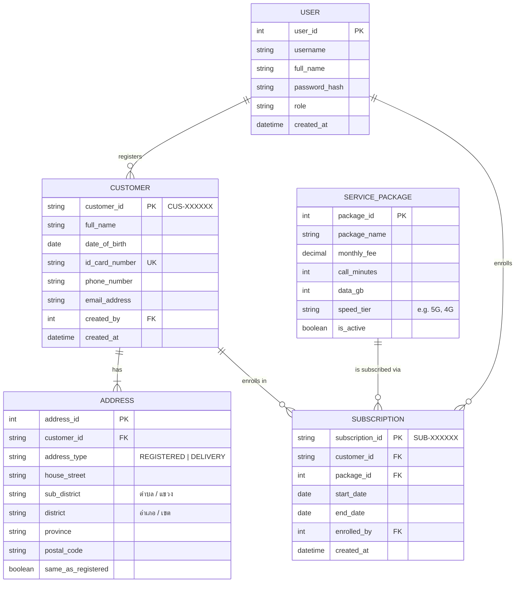

# ER Diagram — ABC-CMS (ABC Customer Management System)

---

## Entity Descriptions

| Entity | Description |
|---|---|
| **USER** | CS Staff account used to log in and perform system operations |
| **CUSTOMER** | Core customer record; `customer_id` is system-generated on successful registration |
| **ADDRESS** | Stores both registered address and document delivery address; `address_type` distinguishes the two |
| **SERVICE_PACKAGE** | Catalogue of available service packages with pricing and inclusions (e.g. 5G Next Speed, 599 ฿/month) |
| **SUBSCRIPTION** | Links a customer to a service package for a defined period; `subscription_id` is system-generated on successful enrollment |

---

## Key Relationships

| Relationship | Cardinality | Description |
|---|---|---|
| USER → CUSTOMER | one-to-many | A CS Staff member can register many customers |
| CUSTOMER → ADDRESS | one-to-many (min 1) | Each customer must have at least one registered address; optionally a separate delivery address |
| CUSTOMER → SUBSCRIPTION | one-to-many | A customer can have multiple service subscriptions over time |
| SERVICE_PACKAGE → SUBSCRIPTION | one-to-many | A package can be subscribed to by many customers |
| USER → SUBSCRIPTION | one-to-many | A CS Staff member can enroll many customers into packages |

---

## Notes

- `customer_id` follows the pattern `CUS-XXXXXX` and is auto-generated by the system.
- `id_card_number` is unique across all customers to prevent duplicate registration.
- `sub_district` stores ตำบล (Tambon) for provincial addresses and แขวง (Khwaeng) for Bangkok addresses; `district` stores อำเภอ (Amphoe) and เขต (Khet) respectively.
- When `same_as_registered = true` on the `DELIVERY` address row, delivery address fields mirror the registered address.
- `created_by` on CUSTOMER references the `USER` who performed the registration, supporting audit trails.
- `USER.full_name` stores the staff member's display name used in the "Registered By" column of the Daily New Customer Report (US-03).
- `subscription_id` follows the pattern `SUB-XXXXXX` and is auto-generated on successful enrollment.
- `enrolled_by` on SUBSCRIPTION references the `USER` (CS Staff) who performed the enrollment.
- `is_active` on SERVICE_PACKAGE controls which packages appear in the enrollment form's package list.

---

## Traceability

| Entity / Field | User Story | Acceptance Criteria |
|---|---|---|
| CUSTOMER (all fields) | US-01 | AC-01-02 |
| ADDRESS (registered) | US-01 | AC-01-03 |
| ADDRESS (delivery) | US-01 | AC-01-04 |
| CUSTOMER.customer_id (auto-generate) | US-01 | AC-01-07, AC-01-08 |
| SERVICE_PACKAGE (all fields) | US-02 | AC-02-03, AC-02-04 |
| SUBSCRIPTION (all fields) | US-02 | AC-02-08 |
| SUBSCRIPTION.subscription_id (auto-generate) | US-02 | AC-02-08 |
| SUBSCRIPTION.start_date, end_date | US-02 | AC-02-05, AC-02-06 |
| CUSTOMER.customer_id, full_name, phone_number, email_address | US-03 | AC-03-04 |
| CUSTOMER.created_at | US-03 | AC-03-02, AC-03-03, AC-03-04 |
| CUSTOMER.created_by → USER.full_name | US-03 | AC-03-04 |
| SUBSCRIPTION.subscription_id, start_date, end_date, created_at | US-04 | AC-04-04 |
| SUBSCRIPTION.enrolled_by → USER.full_name | US-04 | AC-04-04 |
| SUBSCRIPTION.created_at (filter by date) | US-04 | AC-04-02, AC-04-03, AC-04-04 |
| CUSTOMER.customer_id, full_name | US-04 | AC-04-04 |
| SERVICE_PACKAGE.package_name | US-04 | AC-04-04 |